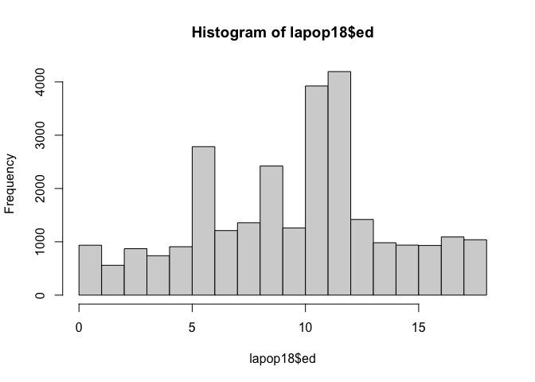
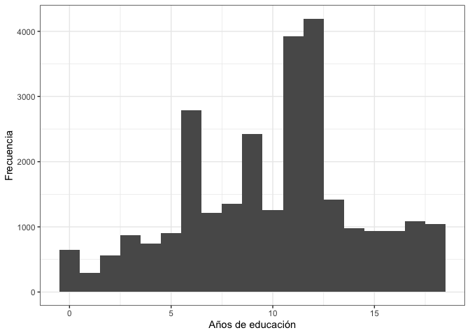
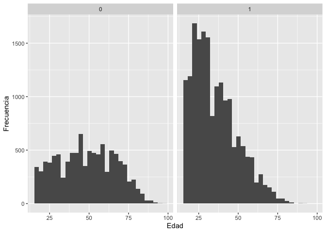
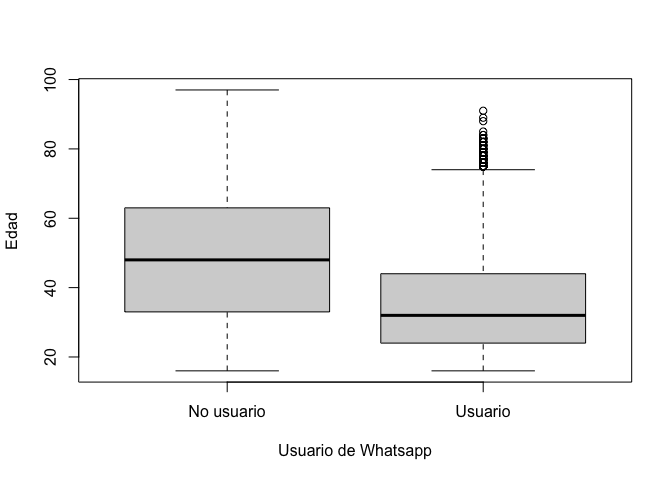

<style type="text/css">
.columns {display: flex;}
h1 {color: #3366CC;}
</style>

# Introducción

En este documento veremos aspectos básicos de cómo describir una variable numérica.
Para eso, vamos a seguir usando el último informe regional "El pulso de la democracia", disponible [aquí](https://www.vanderbilt.edu/lapop/ab2018/2018-19_AmericasBarometer_Regional_Report_Spanish_W_03.27.20.pdf), donde se presentan los principales hallazgos de la ronda 2018/19 del Barómetro de las Américas.
Una de las secciones de este informe, reporta los datos sobre redes sociales y actitudes políticas.
En esta sección, se presentan datos sobre el uso de internet y el uso de redes sociales, en general, por país y por ciertas características sociodemográficas.

# Sobre la base de datos

Los datos que vamos a usar deben citarse de la siguiente manera: Fuente: Barómetro de las Américas por el Proyecto de Opinión Pública de América Latina (LAPOP), wwww.LapopSurveys.org.
En este documento se carga una base de datos recortada.
Esta base de datos se encuentra alojada en el repositorio "materials_edu" de la cuenta de LAPOP en GitHub.
Se recomienda limpiar el Environment antes de comenzar este módulo.

Mediante la librería `rio` y el comando `import` se puede importar esta base de datos desde este repositorio.
Además, se seleccionan los datos de países con códigos menores o iguales a 35, es decir, se elimina las observaciones de Estados Unidos y Canadá.


```r
library(rio)
lapop18 <- import("https://raw.github.com/lapop-central/materials_edu/main/LAPOP_AB_Merge_2018_v1.0.sav")
lapop18 <- subset(lapop18, pais<=35)
```

# Descriptivos para una variable numérica

En la tabla 3.2 del reporte "El pulso de la democracia" se presentan los promedios generales de las variables edad ("q2" en la base de datos) y años de estudio ("ed" en la base de datos) para la población general.
Se usa el comando `mean` para calcular el promedio y se usa `na.rm=T` debido a que estas variables cuentan con valores perdidos.


```r
mean(lapop18$q2, na.rm=T)
```

```
## [1] 39.99204
```

```r
mean(lapop18$ed, na.rm=T)
```

```
## [1] 9.934748
```

En la sección donde trabajamos con variables cualitativas (o de factor, en el lenguaje de R), vimos que se podía describir las variables "hombre" y "urbano" definiendo estas variables como factor, etiquetándolas y haciendo una tabla de frecuencias de estas variables.
Otra manera de encontrar el porcentaje de personas que son hombres o que viven en el área urbana es trabajar con estas variables, pero no definirlas como factor.
Cuando se crean las variables, ambas son definidas por defecto como numéricas.
En este caso, además se ser numéricas, son variables de tipo dummy, es decir con valores 0 y 1.
En el caso de la variable "hombre" se ha definido 0=Mujer y 1=Hombre; y en el caso de la variable "urbano" se ha definido 0=Rural y 1=Urbano.
Es una buena práctica nombrar a la variable dummy con un nombre que refiere a la categoría 1.
Con variables dummy, cuando se calcula el promedio, el resultado es el mismo que el porcentaje de la categoría 1.
Entonces, si se calcula `mean(lapop$hombre, na.rm=T)`, esta operación nos arroja el porcentaje de la categoría 1, es decir de hombres.
Se multiplica por 100 para ponerlo en formato de 0 a 100.


```r
lapop18$hombre <- 2-lapop18$q1
lapop18$urban <- 2-lapop18$ur
mean(lapop18$hombre, na.rm=T)*100
```

```
## [1] 49.74846
```

```r
mean(lapop18$urban, na.rm=T)*100
```

```
## [1] 71.15398
```

Estos son los datos que se presentan en la primera columna de resultados de la población general, excepto para la variable riqueza ("quintall") que no está disponible en esta versión recortada de la base de datos.
Los resultados anteriores no incluyen el factor de expansión.
Para incluirlo en los cálculos se puede usar el comando `weighted.mean`, que es parte de la librería `stats`, que viene precargada con R, por lo que no hay que instalarla.


```r
weighted.mean(lapop18$q2, lapop18$weight1500, na.rm=T)
```

```
## [1] 39.98095
```

```r
weighted.mean(lapop18$ed, lapop18$weight1500, na.rm=T)
```

```
## [1] 9.931417
```

```r
weighted.mean(lapop18$hombre, lapop18$weight1500, na.rm=T)*100
```

```
## [1] 49.74826
```

```r
weighted.mean(lapop18$urban, lapop18$weight1500, na.rm=T)*100
```

```
## [1] 71.11895
```

# Gráficos descriptivos

Luego de describir una variable numérica, también puede incluir algunas gráficas básicas, por ejemplo, usando el comando `hist` se puede producir el histograma de la variable "años de educación" (ed).


```r
hist(lapop18$ed)
```

<!-- -->

Este mismo gráfico se puede reproducir usando el comando `ggplot`.
Con este comando se tiene más flexibilidad con las opciones gráficas.
En primer lugar, se define el dataframe que se usará y la variable "ed" en el eje X.
Luego con la especificación `geom_histogram()` se define usar un histograma.
Se define el ancho de la barra del histograma con `banwidth=1`.
Finalmente, este código permite etiquetar el eje X e Y e incluir un tema en blanco y negro, con `theme_bw()`.


```r
library(ggplot2)
ggplot(lapop18, aes(x=ed))+
  geom_histogram(binwidth = 1)+
  xlab("Años de educación")+
  ylab("Frecuencia")+
  theme_bw()
```

<!-- -->

# Media por grupos

En la página 56 del reporte, se presentan la media de estas variables numéricas por grupos de las variables relacionadas a las redes sociales.
Es decir, por ejemplo, el promedio de años de estudio para los usuarios de Facebook y para los no usuarios de Facebook.
Si queremos calcular el promedio de años de estudio para los usuarios de Facebook, primero se calcula esta variable, de la misma manera que en secciones anteriores, con el comando `ifelse`.


```r
lapop18$fb_user <- ifelse(lapop18$smedia1==1 & lapop18$smedia2<=4, 1, 0)
lapop18$tw_user <- ifelse(lapop18$smedia4==1 & lapop18$smedia5<=4, 1, 0)
lapop18$wa_user <- ifelse(lapop18$smedia7==1 & lapop18$smedia8<=4, 1, 0)
```

El cálculo del promedio de años para los usuarios y no usuarios de Facebook se puede hacer de muchas maneras.
Una primera es usando los corchetes `[...]`.
En este caso, calcularemos el promedio de años de estudio por grupos de usuarios `[lapop18$fb_user==1]` y no usuarios de Facebook `[lapop18$fb_user==0]`.


```r
mean(lapop18$ed[lapop18$fb_user==0], na.rm=T)
```

```
## [1] 8.064905
```

```r
mean(lapop18$ed[lapop18$fb_user==1], na.rm=T)
```

```
## [1] 11.44839
```

# Descriptivos de una variable numérica

Otra manera de describir una variable numérica es usando el comando `summary`.
Este comando reporta los estadísticos descriptivos más usados para una variable numérica: mínimo, máximo, cuartiles, media y mediana.
Todos estos estadísticos permiten una comparación mejor entre ambos grupos, de usuarios y no usuarios de Facebook.
Dentro de este comando se puede incluir la especificación `digits=3` para redondear los resultados, lo que evita tener que usar `round`, por ejemplo.


```r
summary(lapop18$ed[lapop18$fb_user==0], na.rm=T, digits=3)
```

```
##    Min. 1st Qu.  Median    Mean 3rd Qu.    Max.    NA's 
##    0.00    5.00    8.00    8.06   11.00   18.00    1374
```

```r
summary(lapop18$ed[lapop18$fb_user==1], na.rm=T, digits=3)
```

```
##    Min. 1st Qu.  Median    Mean 3rd Qu.    Max.    NA's 
##     0.0     9.0    12.0    11.4    14.0    18.0    1240
```

Sin embargo, el comando `summary` no brinda un estadístico importante como la desviación estándar, una medida de dispersión o heterogeneidad.
Para poder tener los estadísticos anteriores y que se incluya la desviación estándar, entre otras medidas adicionales, se puede usar el comando `describeBy`, que es parte de la librería `psych`.
Este comando pide la variable a describir ("ed") y la variable que forma los grupos ("fb_user") y brinda la media, la desviación estándar, la mediana, la media recortada, la desviación absoluta de la mediana, el mínimo y máximo.


```r
library(psych)
describeBy(lapop18$ed, lapop18$fb_user)
```

```
## 
##  Descriptive statistics by group 
## group: 0
##    vars     n mean  sd median trimmed  mad min max range skew kurtosis   se
## X1    1 11540 8.06 4.3      8    7.99 4.45   0  18    18 0.13    -0.52 0.04
## ------------------------------------------------------------ 
## group: 1
##    vars     n  mean   sd median trimmed  mad min max range  skew kurtosis   se
## X1    1 14998 11.45 3.59     12   11.52 2.97   0  18    18 -0.24        0 0.03
```

Esta misma información se puede obtener usando el modo de códigos del tidyverse (con el operador pype `%>%`) y se puede guardar en una tabla.
Esta tabla puede guardar los datos de la edad promedio para los usuarios y no usuarios de Whatsapp y además la desviación estándar de cada grupo.
En primer lugar definimos con qué dataframe se trabaja.
Luego, se indica que no se usen internamente los valores perdidos de la variable usuarios de Whatsapp con `filter(!is.na(wa_user))`.
A continuación se indica que se va a trabajar en grupos de la variable usuarios de Whatsapp con `group_by(wa_user)`.
Finalmente, se indica que en cada grupo se calculará la media y la desviación estándar, con `summarise`.


```r
library(dplyr)
whatxedad <- lapop18 %>%
  filter(!is.na(wa_user)) %>%
  group_by(wa_user) %>%
  summarise(promedio = mean(q2, na.rm=T), sd = sd(q2, na.rm=T))
whatxedad
```

<div data-pagedtable="false">
  <script data-pagedtable-source type="application/json">
{"columns":[{"label":["wa_user"],"name":[1],"type":["dbl"],"align":["right"]},{"label":["promedio"],"name":[2],"type":["dbl"],"align":["right"]},{"label":["sd"],"name":[3],"type":["dbl"],"align":["right"]}],"data":[{"1":"0","2":"48.25723","3":"18.04314"},{"1":"1","2":"35.38153","3":"13.86258"}],"options":{"columns":{"min":{},"max":[10]},"rows":{"min":[10],"max":[10]},"pages":{}}}
  </script>
</div>

# Gráficos descriptivos por grupos

El reporte no lo muestra, pero se pueden presentar gráficos para cada grupo para facilitar la comparación de una variable.
Para hacer estos gráficos comparativos por grupo, vamos a seguir usando el tidyverse.
Igual que en la tabla anterior, se define el dataframe y se indica que no se tome en cuenta los valores perdidos de la variable "wa_user".
Luego, se indica que se haga un gráfico, con `ggplot` que tenga la variable "q2" en el eje X.
Se define que este gráfico sea un histograma con `geom_histogram()`.
Una novedad es que, con la especificación `facet_wrap(~wa_user)` se puede indicar que se hagan gráficos por cada grupo de esa variable.
Finalmente, se etiquetan los ejes.


```r
lapop18 %>%
  filter(!is.na(wa_user)) %>%
  ggplot(aes(x=q2))+
  geom_histogram()+
  facet_wrap(~wa_user)+
  xlab("Edad")+
  ylab("Frecuencia")
```

<!-- -->

Este gráfico, sin embargo, muestra los valores 0 y 1 de la variable "wa_user" en el encabezado de ambos gráficos.
Esto es debido a que esta variable, cuando se creó, se definió por defecto como numérica.
Para que aparezcan las etiquetas de la variable, se tiene que transformar "wa_user" en factor y etiquetarla.


```r
lapop18$wa_user = as.factor(lapop18$wa_user)
levels(lapop18$wa_user) <- c("No usuario", "Usuario")
```

Otra forma de comparar la distribución de edad por grupos de usuarios o no usuarios de Whatsapp es mediante un gráfico de cajas o boxplot.
Con el comando `boxplot` se puede hacer estos gráficos.
El comando pide primero la variable en el eje Y, luego la variable que define los grupos y el dataframe.
Se puede etiquetar el eje X y Y con los nombres de las variables.
Como la variable "wa_user" ha sido transformada a factor y etiquetada, ahora aparecen las etiquetas.


```r
boxplot(q2 ~ wa_user, data=lapop18, xlab ="Usuario de Whatsapp", ylab="Edad")
```

<!-- -->

# Resumen

En este documento se ha trabajado con variable numéricas, como edad o años de estudio.
Se ha calculado estadísticos descriptivos, como la media o la desviación estándar para toda la población o por grupos.
Finalmente, se ha presentado formas de graficar estas variables, mediante histogramas o boxplots.
