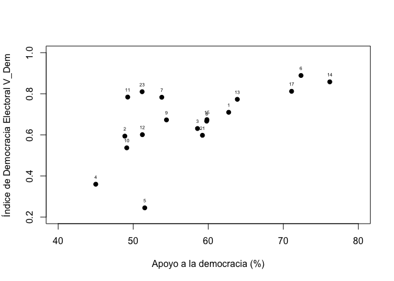
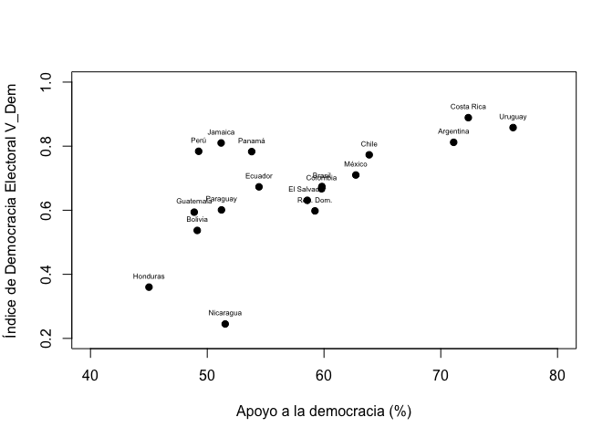
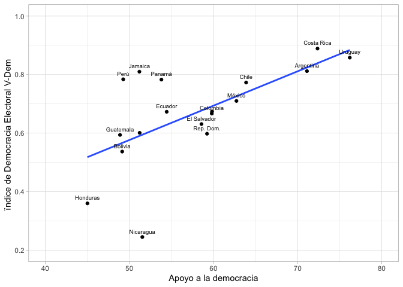

<style type="text/css">
.columns {display: flex;}
h1 {color: #3366CC;}
</style>

# Introducción

Las secciones anteriores correspondientes a la [prueba t](https://arturomaldonado.github.io/BarometroEdu_Web/pruebat.html) y a la prueba de [ANOVA](https://arturomaldonado.github.io/BarometroEdu_Web/anova.html) tratan sobre la relación de una variable numérica con una variable categórica, de tal manera que el objetivo es comparar y extrapolar las medias de la variable numérica por grupos de la variable categórica.
En la sección sobre [tablas cruzadas](https://arturomaldonado.github.io/BarometroEdu_Web/chi.html) se analizó las relaciones bivariadas entre dos variables categóricas (o de factor en la terminología de R).
Esta evaluación se hace mediante tablas cruzadas (o de contingencia) y se evalúa mediante la prueba de chi-cuadrado.

En esta sección veremos la relación bivariada entre dos variables numéricas, usando el gráfico de dispersión para la inspección visual y el coeficiente de correlación de Pearson para la evaluación.
En primer lugar, se cargarán los datos del Barómetro de las Américas 2018/19.

# Sobre la base de datos

Los datos que vamos a usar deben citarse de la siguiente manera: Fuente: Barómetro de las Américas por el Proyecto de Opinión Pública de América Latina (LAPOP), wwww.LapopSurveys.org.
Pueden descargar los datos de manera libre [aquí](http://datasets.americasbarometer.org/database/login.php).
En este enlace, se pueden registrar o entrar como "Free User".
En el buscador, se puede ingresar el texto "2018".
Ahí se tendrá acceso a la base de datos completa "2018 LAPOP AmericasBarometer Merge_v1.0.dta" en versión para STATA.
Se descarga la base de datos en formato zip, la que se descomprime en formato .dta.
Una vez descargada y guardada en el directorio de trabajo, se tiene que leer la base de datos como un objeto dataframe en R.

En este documento se carga una base de datos recortada, originalmente en formato SPSS (.sav).
Esta base de datos se encuentra alojada en el repositorio "materials_edu" de la cuenta de LAPOP en GitHub.
Mediante la librería rio y el comando import se puede importar esta base de datos desde este repositorio.
Además, se seleccionan los datos de países con códigos menores o iguales a 35, es decir, se elimina las observaciones de Estados Unidos y Canadá.


```r
library(rio) 
lapop18 <- import("https://raw.github.com/lapop-central/materials_edu/main/LAPOP_AB_Merge_2018_v1.0.sav")
lapop18 <- subset(lapop18, pais<=35)
```

# Apoyo a la democracia y nivel de democracia

En esta sección seguiremos usando el reporte "El pulso de la democracia", disponible [aquí](https://www.vanderbilt.edu/lapop/ab2018/2018-19_AmericasBarometer_Regional_Report_Spanish_W_03.27.20.pdf).
donde se presentan los principales hallazgos de la ronda 2018/19 del Barómetro de las Américas.
En este informe, se presenta el Gráfico 1.3.
Este es un gráfico de dispersión que relaciona la variable apoyo a la democracia (del Barómetro de las Américas) con el índice de democracia electoral del proyecto [V-Dem](https://www.v-dem.net/en/).
Este gráfico muestra "la relación entre el nivel de apoyo a la democracia y la calificación de la democracia en cada país" (p. 12).

Para reproducir este gráfico se tiene que agregar los resultados por país de la variable ING4.
"Cambiando de tema, la democracia puede tener problemas, pero es mejor que cualquier otra forma de gobierno. ¿En qué medida está de acuerdo o en desacuerdo con esta afirmación?".
Las personas podían responder en una escala del 1 al 7, donde 1 significa "muy en desacuerdo" y 7 "muy de acuerdo".
El reporte indica que se ha recodificado la pregunta original en una variable dummy, donde las respuestas entre 5 al 7 se les considera como que apoyan a la democracia.
En el eje X del gráfico 1.3 se presenta el porcentaje de personas que apoyan a la democracia por país (es decir, aquellos que responden entre 5 y 7 en cada país).

Luego, en la página web del proyecto V-Dem, se puede calcular los puntajes del índice de democracia electoral para cada país (ver [aquí](https://www.v-dem.net/en/analysis/VariableGraph/)).
Por lo tanto, se puede recoger los datos para los 18 países que son parte del reporte "El pulso de la democracia".
Estos datos, luego, se pueden descargar en formato .csv.
El eje Y del gráfico 1.3 muestra los puntajes del índice de democracia electoral de V-Dem en una escala del 0 al 1.
Para este documento se ha recogido los datos del índice de democracia electoral 2018 y 2019 para los 18 países analizados en el reporte, incluyendo el código de país, para poder fusionar los datos luego.
Esta base de datos también se encuentra alojada en el repositorio "materials_edu" de la cuenta de LAPOP en GitHub.


```r
vdem <- import("https://raw.github.com/lapop-central/materials_edu/main/vdem.xlsx")
```

Para reproducir el Gráfico 1.3 tenemos que recodificar la variable la variable ING4 de acuerdo a la regla indicada en el reporte:

-   Valores de ING4 del 1-4 -\> 0 en la nueva variable "apoyo"

-   Valores de ING4 del 5-7 -\> 100 en la nueva variable "apoyo"


```r
library(car)
lapop18$apoyo <- recode(lapop18$ing4, "1:4=0; 5:7=100")
table(lapop18$apoyo)
```

```
## 
##     0   100 
## 11463 15623
```

Con esta nueva variable "apoyo", ahora tenemos que agregar los datos de esta variable por país y guardar esta información en un nuevo dataframe "df".
Para esto usaremos el comando `summarySE` que reporta los estadísticos descriptivos de la variable "apoyo" por país.
Se incluye el N de cada país, el promedio (que sería el porcentaje), la desviación estándar, el error estándar y el tamaño del intervalo de confianza.
En este caso solo requerimos el dato del promedio.
Mirando la tabla, vemos que Uruguay es el país que reporta una mayor proporción de ciudadanos que apoyan a la democracia y además cuenta con la menor desviación estándar, indicando que existe una mayor homogeneidad de las opiniones en comparación con los otros 17 países.


```r
library(Rmisc) #para poder utilizar el comando summarySE
df <- summarySE(data=lapop18, measurevar="apoyo", groupvar="pais", na.rm=T)
df
```

<div data-pagedtable="false">
  <script data-pagedtable-source type="application/json">
{"columns":[{"label":["pais"],"name":[1],"type":["dbl"],"align":["right"]},{"label":["N"],"name":[2],"type":["dbl"],"align":["right"]},{"label":["apoyo"],"name":[3],"type":["dbl"],"align":["right"]},{"label":["sd"],"name":[4],"type":["dbl"],"align":["right"]},{"label":["se"],"name":[5],"type":["dbl"],"align":["right"]},{"label":["ci"],"name":[6],"type":["dbl"],"align":["right"]}],"data":[{"1":"1","2":"1513","3":"62.72307","4":"48.37013","5":"1.243534","6":"2.439235"},{"1":"2","2":"1524","3":"48.88451","4":"50.00396","5":"1.280890","6":"2.512496"},{"1":"3","2":"1465","3":"58.56655","4":"49.27750","5":"1.287448","6":"2.525440"},{"1":"4","2":"1493","3":"45.01005","4":"49.76705","5":"1.287989","6":"2.526461"},{"1":"5","2":"1496","3":"51.53743","4":"49.99307","5":"1.292540","6":"2.535385"},{"1":"6","2":"1458","3":"72.35940","4":"44.73735","5":"1.171633","6":"2.298267"},{"1":"7","2":"1537","3":"53.80612","4":"49.87115","5":"1.272074","6":"2.495186"},{"1":"8","2":"1619","3":"59.78999","4":"49.04734","5":"1.218967","6":"2.390921"},{"1":"9","2":"1512","3":"54.43122","4":"49.81973","5":"1.281225","6":"2.513169"},{"1":"10","2":"1630","3":"49.14110","4":"50.00796","5":"1.238641","6":"2.429496"},{"1":"11","2":"1496","3":"49.26471","4":"50.01131","5":"1.293012","6":"2.536310"},{"1":"12","2":"1478","3":"51.21786","4":"50.00208","5":"1.300621","6":"2.551262"},{"1":"13","2":"1550","3":"63.87097","4":"48.05295","5":"1.220546","6":"2.394097"},{"1":"14","2":"1529","3":"76.19359","4":"42.60379","5":"1.089543","6":"2.137158"},{"1":"15","2":"1471","3":"59.82325","4":"49.04221","5":"1.278685","6":"2.508243"},{"1":"17","2":"1495","3":"71.10368","4":"45.34325","5":"1.172714","6":"2.300340"},{"1":"21","2":"1474","3":"59.22659","4":"49.15800","5":"1.280400","6":"2.511601"},{"1":"23","2":"1346","3":"51.18871","4":"50.00445","5":"1.362969","6":"2.673777"}],"options":{"columns":{"min":{},"max":[10]},"rows":{"min":[10],"max":[10]},"pages":{}}}
  </script>
</div>

Luego, usamos los datos de la columna "vdem2019" del dataframe "vdem" para agregarlos en "df".
Esto lo hacemos con el comando `cbind`, donde se indica el dataframe de destino y los datos a agregar `vdem$vdem2019`.
Se renombra la columna añadida pues por defecto se nombra como la variable.


```r
df <- cbind(df, vdem$vdem2019)
colnames(df)[7] <- "vdem2019"
```

# Diagrama de dispersión

En el dataframe "df" ahora tenemos las dos variables que se grafican en el diagrama de dispersión presentado en el Gráfico 1.3.
Este gráfico lo podemos replicar con el comando `plot`, donde se indica la variable que irá en el eje X y luego la que irá en el eje Y.
Se etiquetan los ejes con `xlab` y `ylab`.
Se fijan los límites de los ejes con `xlim` y `ylim`.
Se agrega las etiquetas de cada punto con el comando `text`, donde se indica que se agregue la etiqueta de la variable `df$pais`.


```r
plot(df$apoyo, df$vdem2019, 
     xlab="Apoyo a la democracia (%)", 
     ylab="Índice de Democracia Electoral V_Dem", 
     pch=19, xlim=c(40, 80), ylim=c(0.2, 1))
text(df$apoyo, df$vdem2019, labels=df$pais, cex=0.5, pos=3)
```

<!-- -->

Sin embargo, estas etiquetas muestran los códigos de los países, Para que muestre los nombres de los países, se tiene que transformar la variable "pais" en una variable de factor "paises" y etiquetar con los nombres.


```r
df$paises <- as.factor(df$pais)
levels(df$paises) <- c("México", "Guatemala", "El Salvador", "Honduras",
                            "Nicaragua","Costa Rica", "Panamá", "Colombia", 
                            "Ecuador", "Bolivia", "Perú", "Paraguay", 
                            "Chile", "Uruguay", "Brasil",
                            "Argentina", "Rep. Dom.", "Jamaica")
table(df$paises)
```

```
## 
##      México   Guatemala El Salvador    Honduras   Nicaragua  Costa Rica 
##           1           1           1           1           1           1 
##      Panamá    Colombia     Ecuador     Bolivia        Perú    Paraguay 
##           1           1           1           1           1           1 
##       Chile     Uruguay      Brasil   Argentina   Rep. Dom.     Jamaica 
##           1           1           1           1           1           1
```

Con esta nueva variable se puede rehacer el gráfico de dispersión con las etiquetas de los países.


```r
plot(df$apoyo, df$vdem2019, 
     xlab="Apoyo a la democracia (%)", 
     ylab="Índice de Democracia Electoral V_Dem", 
     pch=19, xlim=c(40, 80), ylim=c(0.2, 1))
text(df$apoyo, df$vdem2019, labels=df$paises, cex=0.5, pos=3)
```

<!-- -->

Este mismo gráfico se puede reproducir también usando la librería `ggplot`.
En primer lugar se define la estética del gráfico, es decir el dataframe, que será "df", y con la especificación `aes`, las variables en cada eje del gráfico.
Con el comando `geom_point` se indica que se quiere producir un gráfico de puntos.
Un elemento que podemos agregar es la línea de predicción o de ajuste, con el comando `geom_smooth`.
Dentro de este comando se especifica que se use el método lineal con `method=lm` y que no se muestre el intervalo de confianza alrededor de la línea de tendencia, con `se=F`.
Luego, con el comando `geom_text` se incluye las etiquetas a cada punto, desde la variable "paises".
Se usa la especificación `nudge_y` para ajustar verticalmente las etiquetas y `check_overlap=T` para prevenir que las etiquetas se superpongan.
Finalmente, se etiquetan los ejes con `labs(…)`, se define un tema general del gráfico, con `theme_light()` y se definen los límites de los ejes.


```r
library(ggplot2)
ggplot(df, aes(x=apoyo, y=vdem2019))+
  geom_point()+
  geom_smooth(method=lm, se=F)+ #agregar línea de tendencia
  geom_text(data=df, aes(label=paises), cex=2.5, nudge_y = 0.02, check_overlap = T)+ #Pata etiquetar los puntos, darles un tamalo, ubicación y prevenir que se sobrepongan
  labs(x="Apoyo a la democracia", y="ïndice de Democracia Electoral V-Dem ")+ #para etiquetar los ejes
  theme_light()+
  xlim(40, 80)+
  ylim(0.2, 1)
```

<!-- -->

Como se presenta en el gráfico, la distribución de los países se puede resumir con una aproximación lineal mediante una recta.
Esta recta tiene una pendiente positiva, que indica que hay una relación directa entre ambas variables: a medida que un país exhibe un mayor porcentaje de ciudadanos que apoyan a la democracia, se observa un mayor puntaje en el índice de democracia electoral.

# Coeficiente de Correlación de Pearson

Para evaluar la magnitud de la dependencia entre ambas variables, se puede agregar una medida estadística, el coeficiente de correlación R de Pearsons.
Este coeficiente varía entre -1 a +1.
El signo indica la dirección de la relación, mientras el valor indica el grado de la relación.
Si el coeficiente es 0, esto indica una ausencia de relación lineal y mientras más cercano a 1 que existe una mayor relación lineal entre las variables.

El reporte indica que "en general, existe una relación positiva entre las dos medidas (correlación de Pearson =.64). Si bien este análisis es descriptivo y no pone a prueba una relación causal, el patrón es consistente con investigaciones previas donde se identifica que el apoyo de los ciudadanos a la democracia es un ingrediente central para la vitalidad de la democracia".

Se puede usar el comando `cor.test` para calcular el valor del coeficiente de Pearson.
Dentro de este comando se indica qué variable se ubica en cada eje.
Por defecto se calcula es coeficiente de Pearson, pero con la especificación `method="..."` se puede calcular también el coeficiente de Kendall o el de Spearman.


```r
cor.test(x = df$apoyo, y = df$vdem2019)
```

```
## 
## 	Pearson's product-moment correlation
## 
## data:  df$apoyo and df$vdem2019
## t = 3.2105, df = 16, p-value = 0.005456
## alternative hypothesis: true correlation is not equal to 0
## 95 percent confidence interval:
##  0.2247472 0.8456754
## sample estimates:
##       cor 
## 0.6259389
```

Se obtiene un coeficiente de 0.62, que indica una relación positiva, aunque el valor exacto no es igual al que se reporta en el documento, pues los cálculos realizados en este documento no toman en cuenta el efecto del factor de expansión.

# Resumen

En este documento se ha trabajado la relación bivariada entre dos variables numéricas.
La visualización de esa relación se ha hecho mediante el diagrama de dispersión y la evaluación de la relación se ha hecho mediante el coeficiente de correlación de Pearson.

Este es un primer paso en el modelamiento.
En las siguientes secciones se introducirá el modelamiento mediante la técnica de la regresión lineal simple, que es una expresión matemática de lo visto en esta sección.
